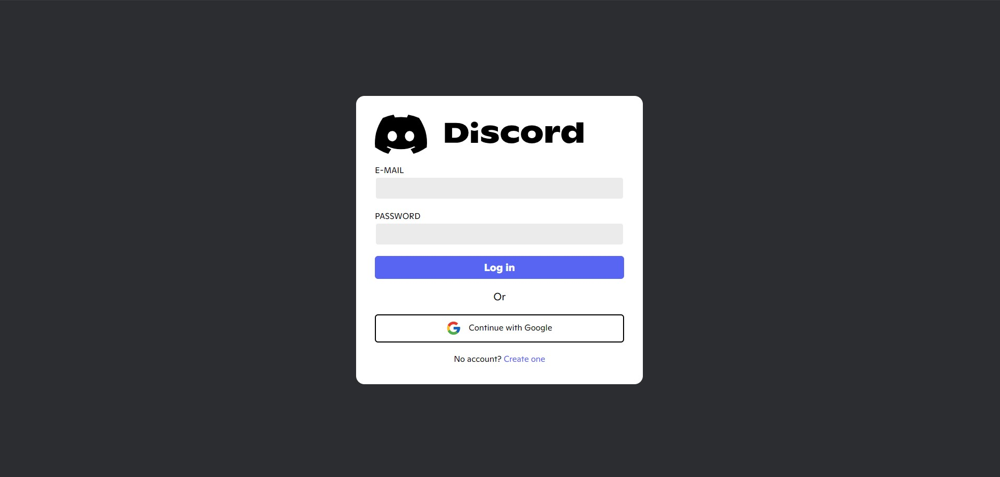
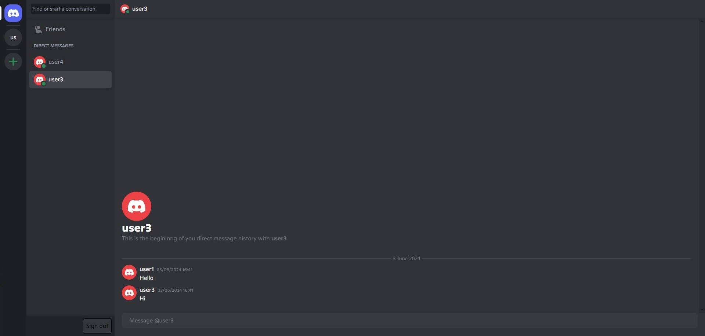
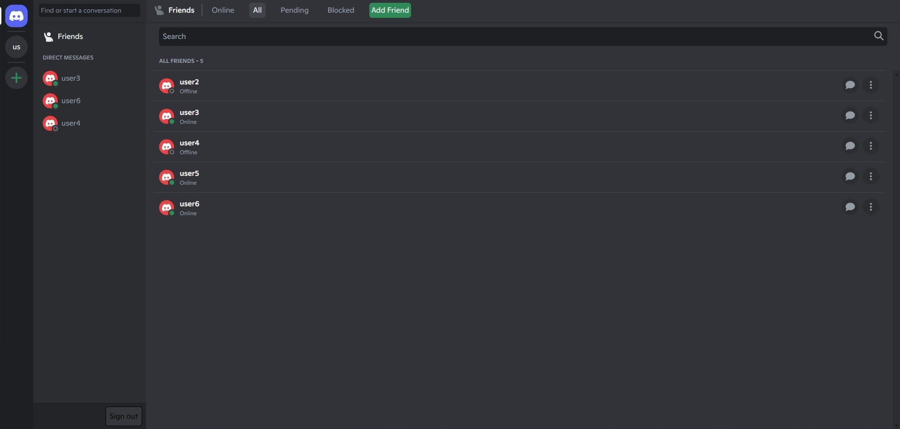
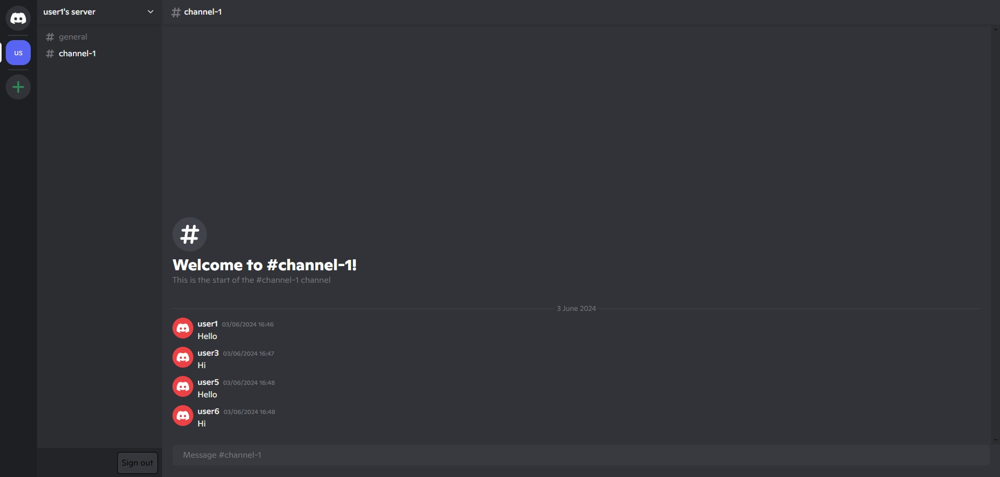
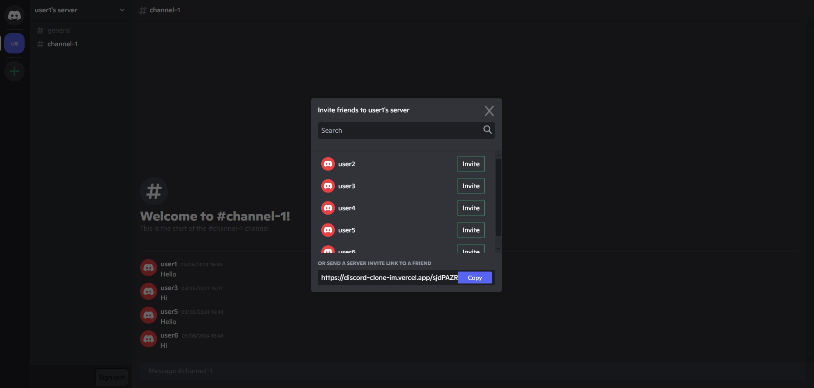

# Discord Clone

Live Site URL: [live site](https://discord-clone-im.vercel.app/)

## Table of Contents

1. [Introduction](#introduction)
2. [Features](#features)
3. [Technologies](#technologies)
4. [Examples](#examples)

## Introduction

This project is created to learn more about web development by working on a larger project, but without designing it from scratch, focusing on replicating Discord's core features to provide practical experience in building a real-time communication platform.

## Features

- User authentication
- Server and Channel Management
- Direct Messaging between users
- Friend Management
- Real-Time Messaging (in progress)

## Technologies

- [TypeScript](https://www.typescriptlang.org/)
- [React](https://reactjs.org)
- [Next.js](https://nextjs.org/)
- [Tailwind CSS](https://tailwindcss.com/)
- [NextAuth.js](https://next-auth.js.org/)
- [PostgreSQL](https://www.postgresql.org/)

## Examples

